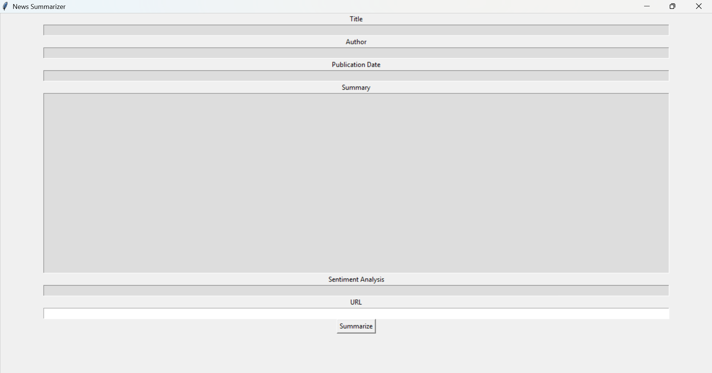

Download the required libraries and run the code

In the URL section paste the news link and it will show you Title, author name, published date, Summary and also it will anlyse the sentiments and give result as "Positive and Negetive".

